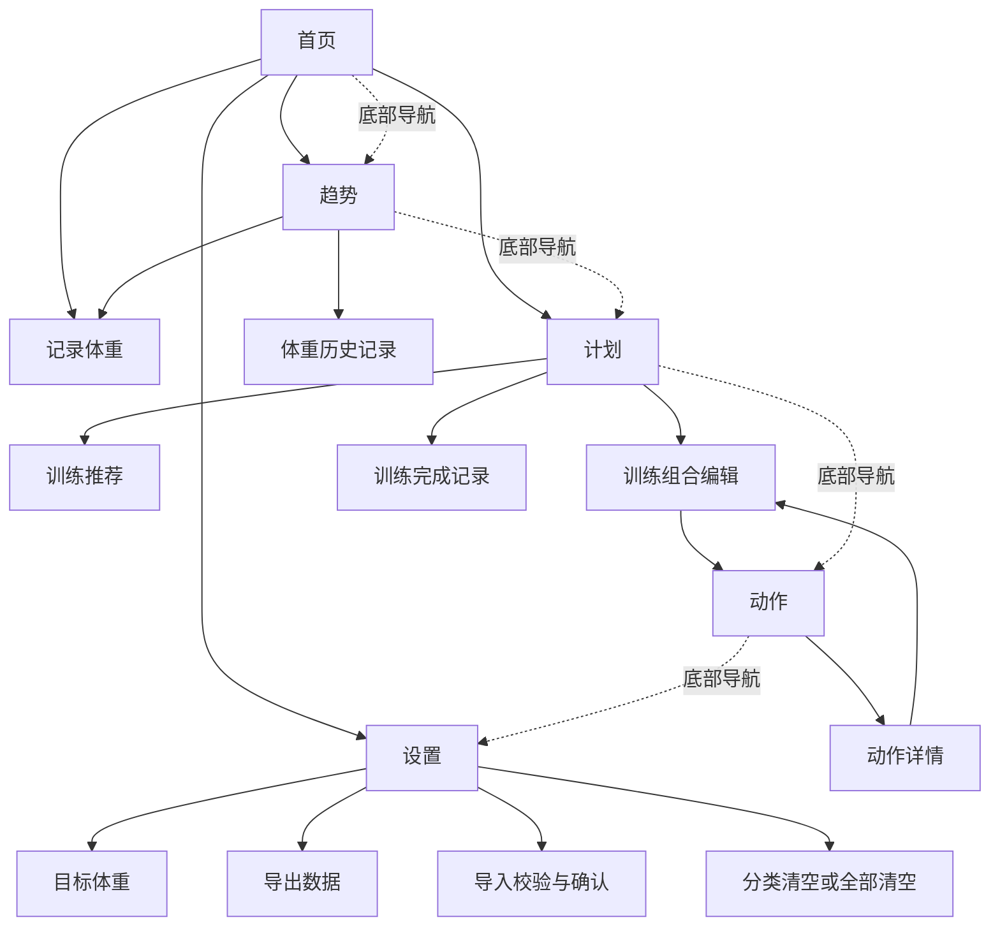

# EthanFitnessRecord：信息架构与交互原型

> 阶段 3 冻结文档。主导航、页面地图、低保真原型和边界状态均已确认。

## 1. 已确认底部导航

底部使用 5 个固定入口，顺序如下：

1. 首页
2. 趋势
3. 计划
4. 动作
5. 设置

确认日期：2026-09-03。

## 2. 页面层级约定

- 一级：5 个底部导航页面；
- 二级：记录体重、训练组合编辑、训练推荐、动作详情、数据导入确认；
- 三级：只允许必要的选择页或危险操作确认，不再继续嵌套；
- 所有核心任务最多经过 3 层页面；
- 二级和三级页面使用返回操作，不额外显示底部导航；
- 危险操作必须经过确认，数据导入在确认前不得修改本地数据。

## 3. 页面地图

## 4. 一级页面内容顺序

### 4.1 首页

1. 日期与问候；
2. 当前体重、目标体重、今日记录次数；
3. “记录体重”主操作；
4. 最近体重趋势摘要；
5. 今日训练及最多 2 个训练组合；
6. 首次使用时显示目标体重设置引导。

### 4.2 趋势

1. 当前体重与阶段变化；
2. 7 天、30 天、3 个月、全部范围切换；
3. 每次记录一个点的体重折线图与目标线；
4. 按时间倒序排列的历史记录；
5. 从历史记录进入修改或删除。

### 4.3 计划

1. 当前周范围；
2. 周一至周日选择；
3. 当天训练或休息状态；
4. 当天最多 2 个训练组合；
5. 新建组合、复制上周和获取建议；
6. 训练完成状态及实际完成数据。

### 4.4 动作

1. 中文搜索；
2. 身体部位筛选；
3. 收藏筛选；
4. 动作缩略图、中文名称、主要肌群、器械和难度；
5. 动作详情入口。

### 4.5 设置

1. 目标体重；
2. 数据存储说明；
3. 导出备份；
4. 导入并完整恢复；
5. 分类清空；
6. 清空全部数据；
7. 健身建议与隐私说明。

## 5. 核心操作路径

### 5.1 首次设置目标

首页首次使用提示 → 设置目标体重 → 校验 20.0–300.0 kg → 保存 → 返回首页显示目标。

### 5.2 记录今日体重

首页“记录体重” → 输入体重和时间 → 校验数值、未来时间与当日 3 条上限 → 保存 → 首页和趋势同步更新。

### 5.3 查看体重趋势

首页趋势摘要或底部“趋势” → 选择时间范围 → 查看每次记录点 → 选择历史记录 → 修改或确认删除。

### 5.4 创建并安排训练

计划 → 选择日期 → 新建组合或获取建议 → 编辑动作和参数 → 确认保存 → 当天计划显示组合。

### 5.5 查找动作指导

动作 → 搜索或部位筛选 → 动作详情 → 查看步骤、动画和安全提示 → 收藏，或在编辑训练组合时添加动作。

## 6. 边界状态补充

- 首次使用和无数据状态；
- 当日已记录 3 次、当天已有 2 个训练组合；
- 文件损坏、版本不兼容和导入失败；
- 删除、完整替换和清空全部数据确认；
- 动画缺失时的占位与纯文字降级；
- 手机窄屏、长中文和安全区检查。

详细规则见 `docs/INTERACTION_STATES.md`。

## 7. 原型验收记录

- 导航确认：已确认
- 页面地图：已确认（2026-09-03）
- 一级页面低保真原型：已确认（2026-09-03）
- 页面状态：已确认（2026-09-03）
- 五条核心路径：主路径和边界反馈均已确认（2026-09-03）
- 手机尺寸检查：360 px 窄屏与 736 px 常规宽度均无横向溢出，关键操作均在可操作区域内
- 脚本检查：交互原型无运行时报错
- 阶段 3 冻结：是（2026-09-04）
